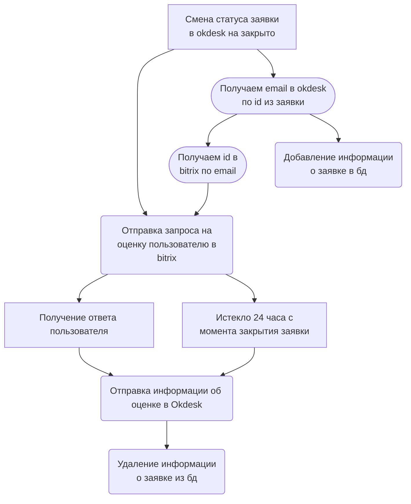

# Инициализация проекта
1. Клонируем репозиторий на сервер 
```
git clone https://github.com/Handlest/okdesk-bitrix
```

2. Создаём виртуальное окружение и устанавливаем необходимые зависимости
```
python -m venv venv
source venv/bin/activate
pip install -r requirements.txt
```
2. Копируем содержимое файла example.env в новый файл .env и настраиваем его под себя

3. Запускаем контейнер с базой данных и fastAPI 
```
docker-compose -f docker-compose.yaml up --remove-orphans --force-recreate --build
```

4. Создаём cron для автоматического оценивания заявок оставленных без ответа

```
crontab -e
0 * * * * cd /путь/до/папки/проекта && venv/bin/python cron_task.py
```

# Пояснение к настройке вебхуков

### Okdesk
1. Создаём вебхук на событие "изменение статуса заявки".  
2. В вызываемом URL указываем `*адрес_сервера*/api/v1/okdesk/create_rate_request`
3. В переменную `OKDESK_ACCOUNT_NAME` передаём имя аккаунта okdesk
4. В переменную `OKDESK_API_TOKEN` токен для вебхука

### Bitrix24
1. Создаём входящий вебхук на метод user.search   
2. Добавляем права: `user`, `user_brief`, `user_basic`, `user.userfield`   
3. Копируем только токен из адреса вида `https://{Пользователь}.bitrix24.ru/rest/1/{Токен} `  
4. Токен добавляем в .env файл в переменную `BITRIX_GET_ID_KEY`   


1. Создаём входящий вебхук на метод `imbot.message.add  `  
2. Добавляем права: `im`, `imbot`    
3. Копируем только токен из адреса вида `https://{Пользователь}.bitrix24.ru/rest/1/{Токен} `
4. Токен добавляем в .env файл в переменную `BITRIX_SEND_MESSAGE_KEY`

# Пайплан работы программы

